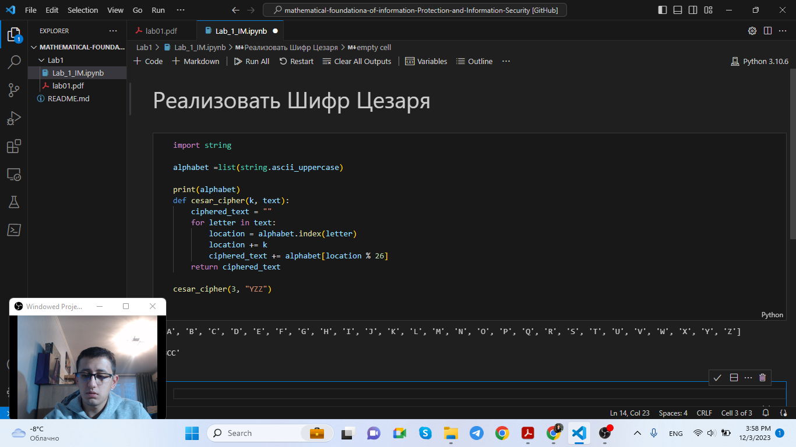

---
# Front matter
title: "Информационная безопасность. Отчет по лабораторной работе № 1"
subtitle: "Шифры простой заменой"
author: "Мухамеджанов Исматулло Иззатуллоевич"
group: NFImd-01-23
institute: RUDN University, Moscow, Russian Federation

# Generic otions
lang: ru-RU
toc-title: "Содержание"

# Bibliography
csl: pandoc/csl/gost-r-7-0-5-2008-numeric.csl

# Pdf output format
toc: true # Table of contents
toc_depth: 2
lof: true # List of figures
lot: true # List of tables
fontsize: 12pt
linestretch: 1.5
papersize: a4
documentclass: scrreprt
### Fonts
mainfont: PT Serif
romanfont: PT Serif
sansfont: PT Sans
monofont: PT Mono
mainfontoptions: Ligatures=TeX
romanfontoptions: Ligatures=TeX
sansfontoptions: Ligatures=TeX,Scale=MatchLowercase
monofontoptions: Scale=MatchLowercase,Scale=0.9
## Biblatex
biblatex: true
biblio-style: "gost-numeric"
biblatexoptions:
  - parentracker=true
  - backend=biber
  - hyperref=auto
  - language=auto
  - autolang=other*
  - citestyle=gost-numeric
## Misc options
indent: true
header-includes:
  - \linepenalty=10 # the penalty added to the badness of each line within a paragraph (no associated penalty node) Increasing the value makes tex try to have fewer lines in the paragraph.
  - \interlinepenalty=0 # value of the penalty (node) added after each line of a paragraph.
  - \hyphenpenalty=50 # the penalty for line breaking at an automatically inserted hyphen
  - \exhyphenpenalty=50 # the penalty for line breaking at an explicit hyphen
  - \binoppenalty=700 # the penalty for breaking a line at a binary operator
  - \relpenalty=500 # the penalty for breaking a line at a relation
  - \clubpenalty=150 # extra penalty for breaking after first line of a paragraph
  - \widowpenalty=150 # extra penalty for breaking before last line of a paragraph
  - \displaywidowpenalty=50 # extra penalty for breaking before last line before a display math
  - \brokenpenalty=100 # extra penalty for page breaking after a hyphenated line
  - \predisplaypenalty=10000 # penalty for breaking before a display
  - \postdisplaypenalty=0 # penalty for breaking after a display
  - \floatingpenalty = 20000 # penalty for splitting an insertion (can only be split footnote in standard LaTeX)
  - \raggedbottom # or \flushbottom
  - \usepackage{float} # keep figures where there are in the text
  - \floatplacement{figure}{H} # keep figures where there are in the text

---

# Цель работы
Освоить на практике применение шифрование простой заменой [1].

# Указание к работе
Исходные данные.
Шифр Цезаря
Шифр Атбаш
# Выполнение лабораторной работы
1.	Шифр Цезаря.

В основе функционирования шифров простой замены лежит следующий принцип: для получения шифртекста отдельные символы или группы символов исходного алфавита заменяются символами или группами символов шифроалфавита.
Шифр Цезаря (также он является шифром простои замены) — это моноалфавитная попстановка, т.е. каждой букве открытого текста ставится в соответствие одна буква шифртекста. На практике при создании шифра простой замены в качестве піифроалфавита берется исхоqныи алфавит, но с нарушенным порядком букв {тlфавитная перестановка). Д,пя запоминания нового порядка букв перемешивание алфавита осуществляется с помощыо пароля. В качестве пароля могут выступать слово или несколько слов с неповторяіощимися буквами. Шифровальная таблица состоит из двух строк: в первой записывается стандартный алфавит открытого текста, во второй — начиная с некоторой позиции размещается пароль (пробелы опускаіотся), а далее идут в алфавитном порядке оставшиеся буквы, не вовіедшие в пароль. В случае несовпаqения начала пароля с началом строки процесс после ее завершения циклически продолжается с первой позиции. Кліочом шифра служит пароль вместе с числом, указываіощим гіоложение начальной буквы пароля. Таблица шифрования на ключе 4 пароль буqет иметь вид:
а 6 в  г  д е ж з и й к л м н о п р с  т у ф х ц ч ш щ ъ ьі ь  э ю я
м э ю я в  а  р о л ь 6 в г д е ж з  и ii к м н с  т у ф х ц ч ш щ ъ
В  процессе  шифрования	каждая  буква	открытого	текста	заменяется	на
стоящуіо под ней букву.
 
B 1 B. H.3. IO. L e3apь Bo Bpeмя BoĞHьI C FaлJiiìMH, пepeпиcьIBiiżtGh CO GBOHMH дpyзbяMH B PiiMe, зaMeнxл B coo6iueHHH пepB 6yxBy лaтHHCKOFO HH £tBHT£t (A) Hit чeтBepтyio (D), BTOj3   (B) — H£t Ilя   (E), HaкoHeil, пocлepHioio — Ha TpeTbю:
A B C D E F G H I J	K L M N O P Q R S T U V W X Y Z
D E F G H I J K L M N O P Q R S T U V W X Y Z A B C
QoHeceHиe IO. L eзapя CeHaтy o6 oдepжaHHoĞ	M пo6eqe Haq fIOHTHÎÎCKHM цapeM BьIFлядeлo тaк:
YHQL YLGL  YLFL ("Veni, vidi, vici" — лaт,  flpишeл, yBHqeл, пo6eqHл").
ИMnepaTOp	BrycT (1 B. H. 3.) B cBoeñ пepeпHcKe 3aMeнял пepB	6	B	Hit
BTO]3  , BTO]3yю — Ha TpeTью H T, q., HaкoHeu, пocлenHюlo — ma пepByтo:
A B C D E F G H I J	K L M N O P Q R S T U V W X Y Z
B C D E F G H I I	K L M N O P Q R S T U V W X Y Z A
JIiOòHMoe HзpeчeHHe HMпepaTopa AвгyCTíì BhIF’ляneлo TaK:
GFTUJOB  MFOUF  ("Festina lente" — лitT. "TopOпHcь MenлeHHo").
H3	пpHMepoв	BH,QHO,	HTO	изMeнxs	BeлHчHHy	cдBHF£l,	MOKHO	HOJI	HTh Hecкoлbкo paзHbIX KQ HTOPQ£IMM QJIB O,QHOF’O HGXOqHOro тeKcTa.
MaтeMaтичecKH пpoueoypy шHф}3OB£ìHHH MOHtHO Oпиcaтs cлeqyтoII HM O6paзoM:
Tg -—	T!’ , j -— 0,1, ... , m — 1,
T!’{a)	(a -F j)mod m,
rue  {a - j)mod m — onepaциR HaXoждeHHя OGTaTкa o+ uenoчHcneHHoгo qeneHия a + /  H£t Tit; Tp  — lJHKnHчecKaя пoдгpyппa. IIpoHyмepyeM 6yxBE•I JI£tTHHCKO£’O all  iãBHTã OT 0 дo 25: n — 0, f› = 1, c = 3, ... , z = 25. B nilTHHGKOM aflфilBHтe 26 fìJB H HOэтoMy пpиMeM m 26. Toгдa oпepauHio IIIH ]3OBdHHżt 3£fпHшeM B BHдe: 6yъB£t C HoMepoM i 3aMeHseTcя Ha 6yxøy c HoMepoM (i -ł- 3) mod 26. BO8MOHHO H O6o6щeHHe шифpa  eзapя Ha GJIyчañ пJ3OH3BOJIhHOFO Kflioчa k : CHMBOJI C HoMepoM i 3aMeнHTCżt H£t CHMBOJi C HoMepoм (i + k)mod 26.
TaкиM	o6J3aзOM,	OTK]3hITbiй	TeKcT	aO, at. --- . •N - i	пpeo6paзyeTcя	B
кpHпTOFpaMMy  Г' (iз0). T  (''	), ... , T!‘ (aN _ ). IJpH иCHOJIh8OBżìHHH ,fÏ,Jlżt IIIH ]3OBiìHHżt
HOØ,CT£tHOBKH  T!’  GHMBOJI  n  OTKQbITOгo  тeKcTa  зaMeняeTcя  CHMBOJIOM  O +
 
шифрованного текста. Цезарь обычно для тифрования использовал подстановку
Т’.
Взлом такого шифра осуществляется путем анализа частотных характеристик языка открытых текстов. Например, в русском тексте длиной 10000 символов буква О встречается в среднем 1047 раз, Е — 836, А — 808, Н — 723 и т.д. Поэтому, если в достаточно длинной криптограмме какой-то символ встречается чаще остальных, то есть все основания полагать, что это буква О.
2.	Шифр Атбаш.

Данный шифр является шифром сдвига на всю длину алфавита. Для алфавита, состоящего только из русских букв и пробела, таблица шифрования будет иметь следующий вид:
а 6 в г д е ж з и й к л м н о п р с т у ф х ц ч ш щ ъ ы ь э ю я
р	я ю э ь ьі ъ щ ш ч ц х ф у т с р п о н м л к и и з ж е д г в 6 а При программной реализации шифра Атбаш на языке Pascal целесообразно использовать таблицу ASCII и функции работы с ней (ord и char). Далее показана функция	перевода	символа	открытого	текста	в	шифр	путем	зеркального
отражения по таблице ASCII.

Function Atbash(openchar:char):char; Begin
Atbash := 255 — ord(openchar); End.

{#fig:1 width=100%}

){#fig:2 width=100%}

<!-- {#fig:3 width=100%}

{#fig:4 width=100%} -->

<!-- {#fig:5 width=100%} -->

<!-- ## Контрольные вопросы
1. Как, зная один из текстов (P1 или P2), определить другой, не зная при
этом ключа? -- По формулам: C1 ⊕ C2 ⊕ P1 = P2, C1 ⊕C2 ⊕ P2 = P1.

2. Что будет при повторном использовании ключа при шифровании текста? -- Расшифровка текста.

3. Как реализуется режим шифрования однократного гаммирования одним
ключом двух открытых текстов? -- Ключ применяется к каждому из текстов в отдельности, получаются два различных шифротекста.

4. Перечислите недостатки шифрования одним ключом двух открытых
текстов. -- При наличии минимум двух шифротекстов и хотябы одного открытого текста можно получить другой открытый текст даже не имея ключа.

5. Перечислите преимущества шифрования одним ключом двух открытых
текстов. -- Нет необходимости в хранении двух последовательностей символов ключа. -->

# Выводы
Освоено на практике применение шифрования на основах
шифрования Цезаря и Атбаш. 

# Список литературы
1. Методические материалы курса
2. Википедия

