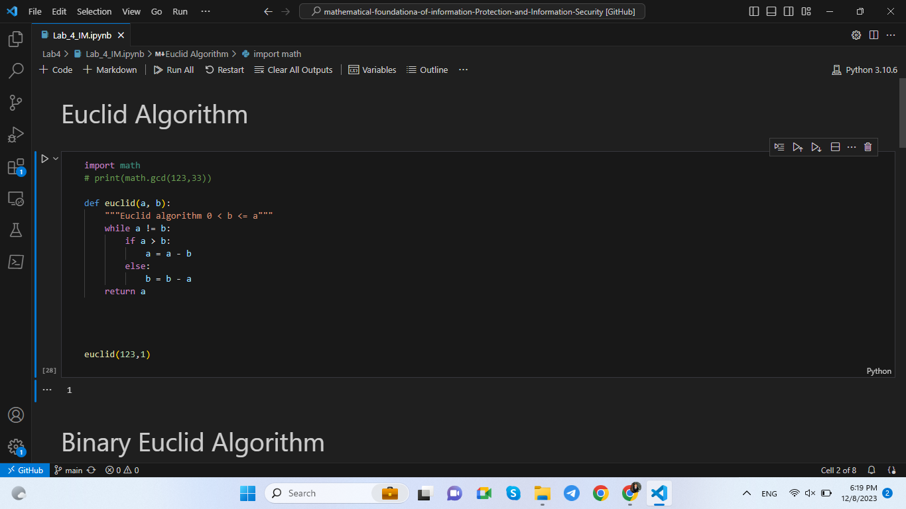
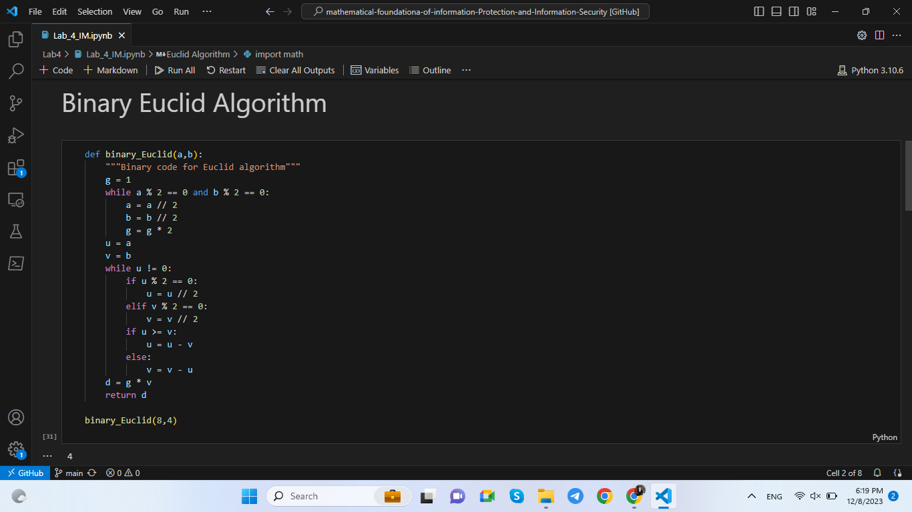
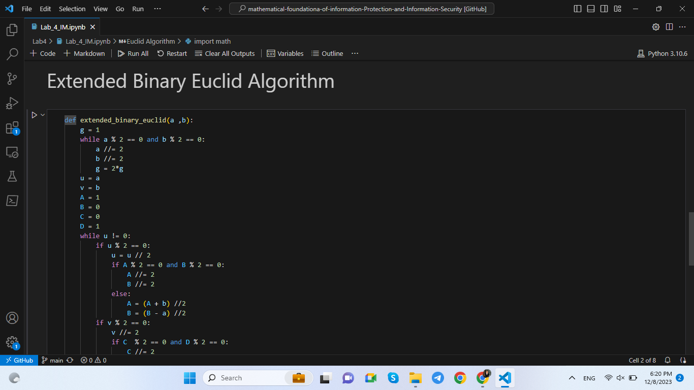
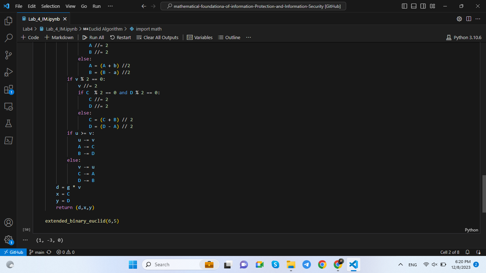
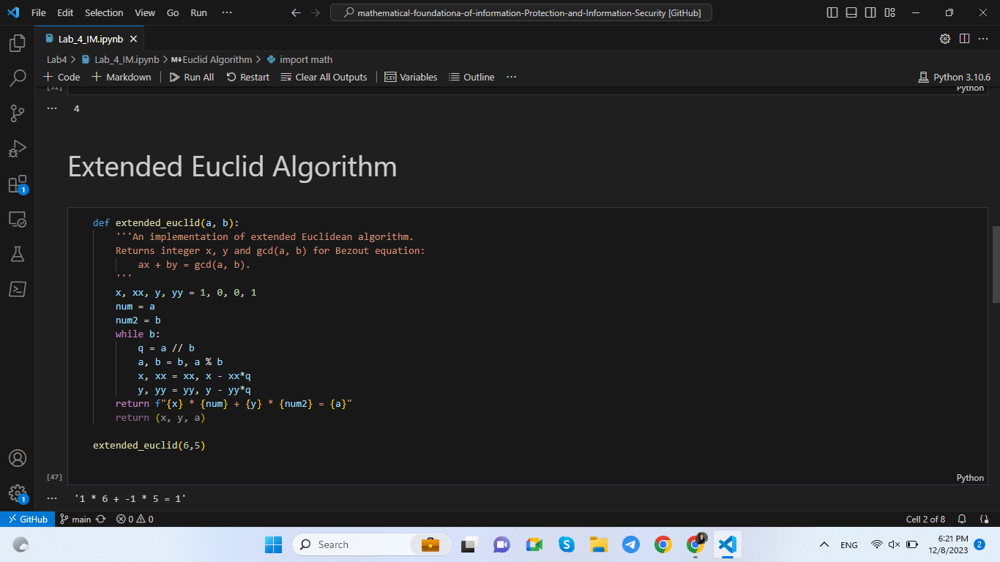

---
## Front matter
lang: ru-RU
title: Информационная безопасность. Лабораторная работа № 4 на тему "Вычисление наибольшего общего делителя на основе алгоритмов"
author: Мухамеджанов Исматулло Иззатуллоевич
group: NFImd-01-23
institute: RUDN University, Moscow, Russian Federation

## Formatting
toc: false
slide_level: 2
theme: metropolis
header-includes: 
 - \metroset{progressbar=frametitle,sectionpage=progressbar,numbering=fraction}
 - '\makeatletter'
 - '\beamer@ignorenonframefalse'
 - '\makeatother'
aspectratio: 43
section-titles: true
---

# Содержание
* Цели и задачи
* Выполнение
* Результаты
* Список литературы

# Цели и задачи
Освоить на практике применение вычисление Наибольшего Общего Делителя(НОД).

# Выполнение
## Выполнение
{#fig:form1 width=100%}

## Выполнение
{#fig:form1 width=100%}

## Выполнение
{#fig:form1 width=100%}

## Выполнение
{#fig:form1 width=100%}

## Выполнение
{#fig:form1 width=100%}

<!-- ## Выполнение

## Выполнение
 -->

# Результаты
Освоено на практике применение алгоритмов определения НОД.

# Список литературы
1. Методические материалы курса