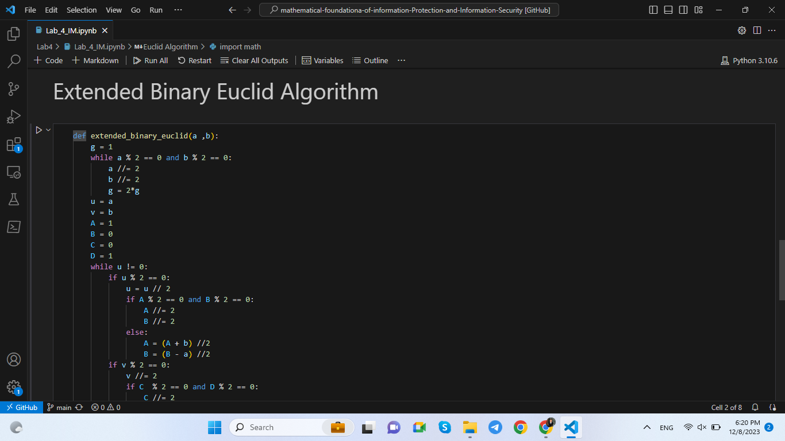
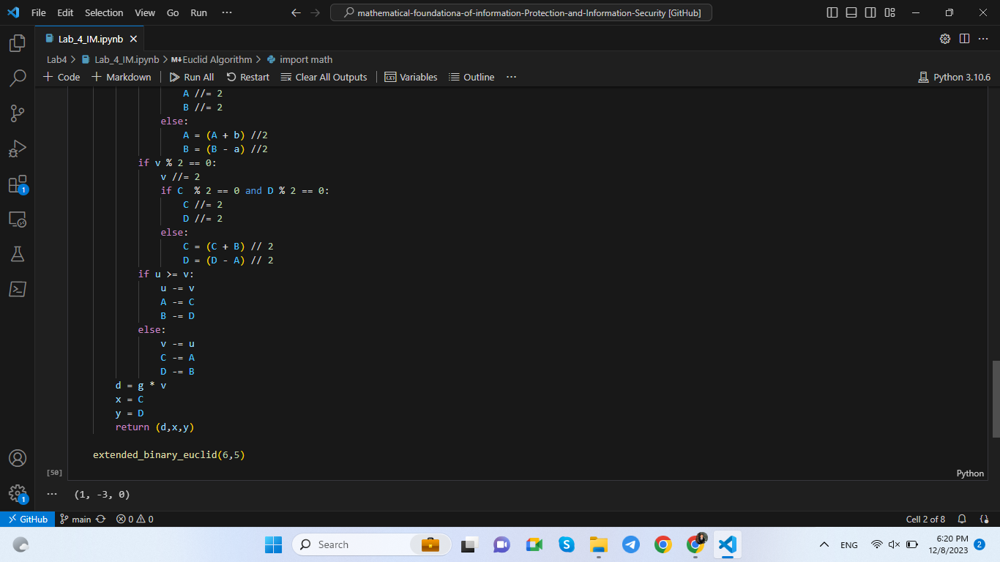
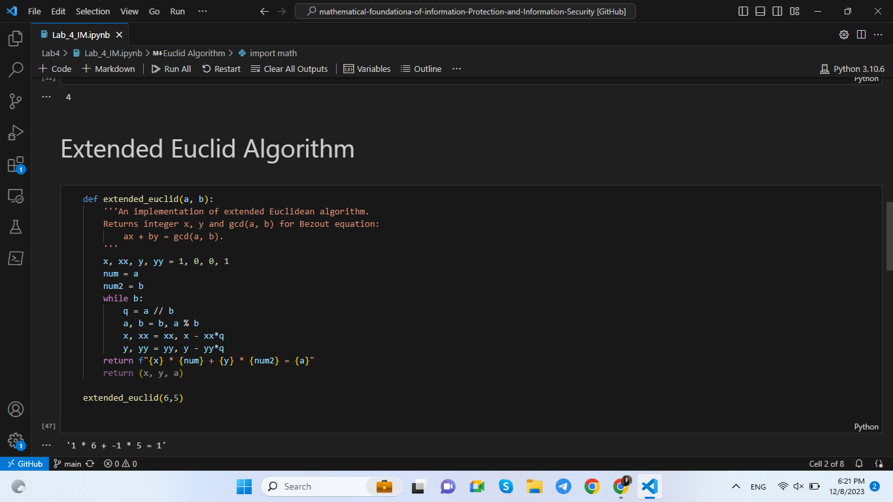

---
# Front matter
title: "Информационная безопасность. Отчет по лабораторной работе № 4"
subtitle: "Вычисление наибольшего общего делителя"
author: "Мухамеджанов Исматулло Иззатуллоевич"
group: NFImd-01-23
institute: RUDN University, Moscow, Russian Federation

# Generic otions
lang: ru-RU
toc-title: "Содержание"

# Bibliography
csl: pandoc/csl/gost-r-7-0-5-2008-numeric.csl

# Pdf output format
toc: true # Table of contents
toc_depth: 2
lof: true # List of figures
lot: true # List of tables
fontsize: 12pt
linestretch: 1.5
papersize: a4
documentclass: scrreprt
### Fonts
mainfont: PT Serif
romanfont: PT Serif
sansfont: PT Sans
monofont: PT Mono
mainfontoptions: Ligatures=TeX
romanfontoptions: Ligatures=TeX
sansfontoptions: Ligatures=TeX,Scale=MatchLowercase
monofontoptions: Scale=MatchLowercase,Scale=0.9
## Biblatex
biblatex: true
biblio-style: "gost-numeric"
biblatexoptions:
  - parentracker=true
  - backend=biber
  - hyperref=auto
  - language=auto
  - autolang=other*
  - citestyle=gost-numeric
## Misc options
indent: true
header-includes:
  - \linepenalty=10 # the penalty added to the badness of each line within a paragraph (no associated penalty node) Increasing the value makes tex try to have fewer lines in the paragraph.
  - \interlinepenalty=0 # value of the penalty (node) added after each line of a paragraph.
  - \hyphenpenalty=50 # the penalty for line breaking at an automatically inserted hyphen
  - \exhyphenpenalty=50 # the penalty for line breaking at an explicit hyphen
  - \binoppenalty=700 # the penalty for breaking a line at a binary operator
  - \relpenalty=500 # the penalty for breaking a line at a relation
  - \clubpenalty=150 # extra penalty for breaking after first line of a paragraph
  - \widowpenalty=150 # extra penalty for breaking before last line of a paragraph
  - \displaywidowpenalty=50 # extra penalty for breaking before last line before a display math
  - \brokenpenalty=100 # extra penalty for page breaking after a hyphenated line
  - \predisplaypenalty=10000 # penalty for breaking before a display
  - \postdisplaypenalty=0 # penalty for breaking after a display
  - \floatingpenalty = 20000 # penalty for splitting an insertion (can only be split footnote in standard LaTeX)
  - \raggedbottom # or \flushbottom
  - \usepackage{float} # keep figures where there are in the text
  - \floatplacement{figure}{H} # keep figures where there are in the text

---

# Цель работы
Освоить на практике применение вычисление Наибольшего Общего Делителя(НОД).

# Указание к работе
Алгоритм Евклида

Бинарный алгоритм Евклида

Расширенный алгоритм Евклида

Расширенный бинарный алгоритм Евклида

# Выполнение лабораторной работы
1.	Алгоритм Евклида.

  Вход. Целые числа n, b; 0 < b Е а. Выход.d -— НОД(n, b).
	ПОЛОЖИТЬ Р	О, гу	b, i ‹= 1.
	Найти остаток гдр рот деления r¡_ наг¡.
	Если my	= 0, то положить d +- r¡. В противном случае положить i +- i -1- 1 и вернуться на віаг 2.
	Результат: d.
  Бинарный алгоритм ЕвклиЬа является более быстрым при реализации на компьютере, поскольку использует двоичное представление чисел п и Ь. hинарный алгоритм Евклида основан па следутощих свойствах наиболыиего общего делитепя (считаем, что 0 < b й n):
	если оба числа n и b четнме, то Н0Д(n, b) —— 2 Н0Д(J, );
	если число n — нечетное, число b — четное, то Н0Д(n, b)	НОД(n,2)
	если оба числа n и b нечетные, n > b, то Н0Д(n, b) —— НОД(n — b,b),’
	если n = b, то Н0Д(n, b) —— n.

2.	Бинарный алгоритм Евклида.

  Бинарный алгоритм Евклида — метод нахождения наибольшего общего делителя двух целых чисел. Данный алгоритм «быстрее» обычного алгоритма Евклида, так как вместо медленных операций деления и умножения используются сдвиги[1]. Но это преимущество в скорости теряется с увеличением разницы между целыми числами более чем на несколько порядков, в результате чего число итераций вычитания (см. шаги 6, 7 в разделе Алгоритм) может многократно превышать число итераций обычного алгоритма, использующего сравнение по модулю. То есть скорость бинарных сдвигов дает эффект только для чисел близких друг другу.

  Возможно, алгоритм был известен еще в Китае 1-го века[2], но опубликован был лишь в 1967 году израильским физиком и программистом Джозефом Стайном. Он основан на использовании следующих свойств НОД:

  НОД(2m, 2n) = 2 НОД(m, n),
  НОД(2m, 2n+1) = НОД(m, 2n+1),
  НОД(-m, n) = НОД(m, n)

3.	Расширенный алгоритм Евклида.
  Целые числа a,b: 0 < b <= a
  Выход НОД(a,b); такие числа x,y, что ax + by = d

4.	Расширенный бинарный алгоритм Евклида.
  Целые числа a,b: 0 < b <= a
  Выход НОД(a,b)
  g = 1
  a и b нечетные, a = a / 2 , b = b /2 , g = 2*g пока a или b один из них не станет нечётным
  u = a, v = b, A = 1, B = 0, C = 0, D = 1
  U != 0, u %2 == 0 : u = u / 2, A = A /2, B = B /2,
  A = (A + b) / 2, B = (B - a) / 2
  v %2 == 0 : v = v / 2, C = C /2, D = D /2,
  C = (C + b) / 2, D = (D - a) / 2
  u >= v, u = u - v, A = A - C, B = B - D,
  else v = v - u, C = C - A, D = D - B

  d = g*v, x = C, y = D
  Вывод d,x,y

{#fig:1 width=100%}

{#fig:2 width=100%}

{#fig:3 width=100%}

{#fig:4 width=100%} 

{#fig:5 width=100%} 

<!-- {#fig:5 width=100%}

<!-- ## Контрольные вопросы
1. Как, зная один из текстов (P1 или P2), определить другой, не зная при
этом ключа? -- По формулам: C1 ⊕ C2 ⊕ P1 = P2, C1 ⊕C2 ⊕ P2 = P1.

2. Что будет при повторном использовании ключа при шифровании текста? -- Расшифровка текста.

3. Как реализуется режим шифрования однократного гаммирования одним
ключом двух открытых текстов? -- Ключ применяется к каждому из текстов в отдельности, получаются два различных шифротекста.

4. Перечислите недостатки шифрования одним ключом двух открытых
текстов. -- При наличии минимум двух шифротекстов и хотябы одного открытого текста можно получить другой открытый текст даже не имея ключа.

5. Перечислите преимущества шифрования одним ключом двух открытых
текстов. -- Нет необходимости в хранении двух последовательностей символов ключа. -->

# Выводы
Освоены методы определения НОД

# Список литературы
1. Методические материалы курса
2. Википедия

