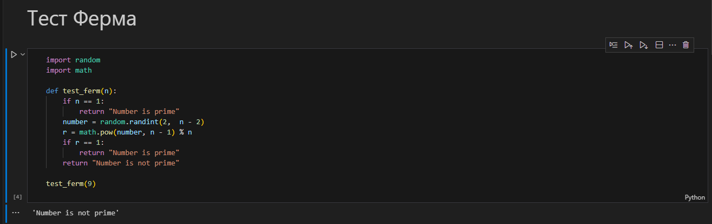
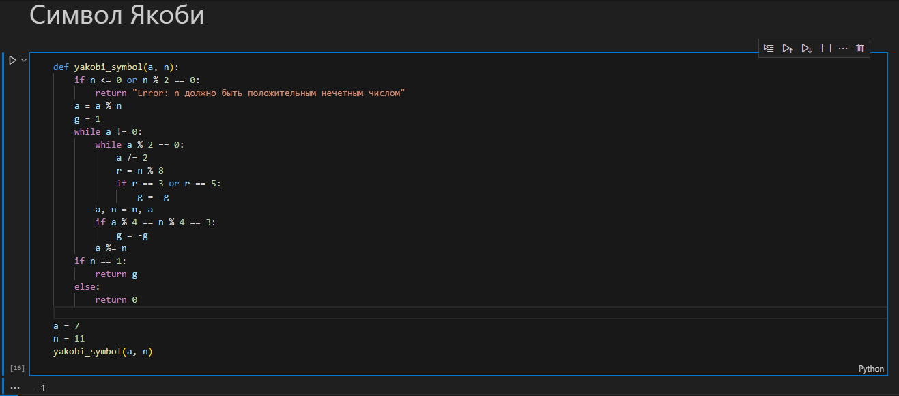
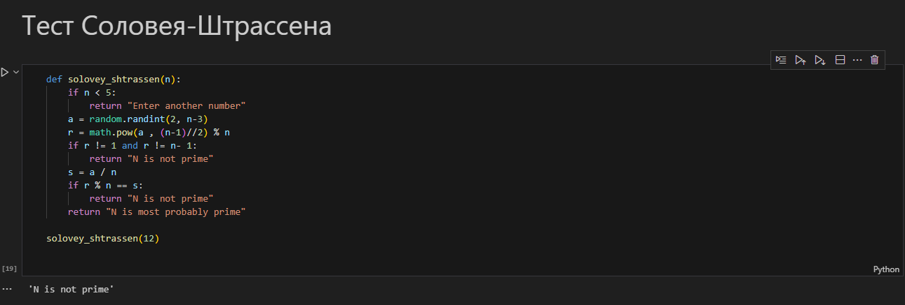
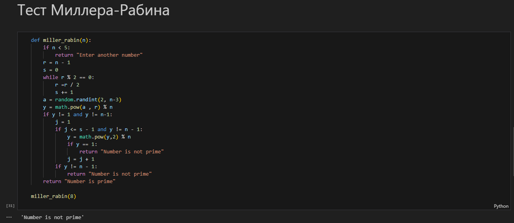

---
# Front matter
title: "Информационная безопасность. Отчет по лабораторной работе № 5"
subtitle: "Вероятностные алгоритмы проверки чисел на простоту"
author: "Мухамеджанов Исматулло Иззатуллоевич"
group: NFImd-01-23
institute: RUDN University, Moscow, Russian Federation

# Generic otions
lang: ru-RU
toc-title: "Содержание"

# Bibliography
csl: pandoc/csl/gost-r-7-0-5-2008-numeric.csl

# Pdf output format
toc: true # Table of contents
toc_depth: 2
lof: true # List of figures
lot: true # List of tables
fontsize: 12pt
linestretch: 1.5
papersize: a4
documentclass: scrreprt
### Fonts
mainfont: PT Serif
romanfont: PT Serif
sansfont: PT Sans
monofont: PT Mono
mainfontoptions: Ligatures=TeX
romanfontoptions: Ligatures=TeX
sansfontoptions: Ligatures=TeX,Scale=MatchLowercase
monofontoptions: Scale=MatchLowercase,Scale=0.9
## Biblatex
biblatex: true
biblio-style: "gost-numeric"
biblatexoptions:
  - parentracker=true
  - backend=biber
  - hyperref=auto
  - language=auto
  - autolang=other*
  - citestyle=gost-numeric
## Misc options
indent: true
header-includes:
  - \linepenalty=10 # the penalty added to the badness of each line within a paragraph (no associated penalty node) Increasing the value makes tex try to have fewer lines in the paragraph.
  - \interlinepenalty=0 # value of the penalty (node) added after each line of a paragraph.
  - \hyphenpenalty=50 # the penalty for line breaking at an automatically inserted hyphen
  - \exhyphenpenalty=50 # the penalty for line breaking at an explicit hyphen
  - \binoppenalty=700 # the penalty for breaking a line at a binary operator
  - \relpenalty=500 # the penalty for breaking a line at a relation
  - \clubpenalty=150 # extra penalty for breaking after first line of a paragraph
  - \widowpenalty=150 # extra penalty for breaking before last line of a paragraph
  - \displaywidowpenalty=50 # extra penalty for breaking before last line before a display math
  - \brokenpenalty=100 # extra penalty for page breaking after a hyphenated line
  - \predisplaypenalty=10000 # penalty for breaking before a display
  - \postdisplaypenalty=0 # penalty for breaking after a display
  - \floatingpenalty = 20000 # penalty for splitting an insertion (can only be split footnote in standard LaTeX)
  - \raggedbottom # or \flushbottom
  - \usepackage{float} # keep figures where there are in the text
  - \floatplacement{figure}{H} # keep figures where there are in the text

---

# Цель работы
Освоить на практике применение вероятностные алгоритмы проверки чисел на простоту

# Указание к работе
Тест Ферма
Символ Якоби
Тест Соловея-Штрассена
Тест Миллера-Рибена
# Выполнение лабораторной работы
1.	Тест Ферма
  Вход. Нечетное целое число n >= 5.
  Выход. «Число n, вероятно, простое» или «Число n составное».

  Выбрать случайное целое число a, 2 <= a <= n — 2.
  Вычислить r = a ^ n-1  (mod n).
  При r = 1 результат: «Число n, вероятно, простое». В противном случае результат: «Число n составное».

2.	Алгоритм вычисления символа Якоби.
  Положить g +- 1.
 
	При п = 0 результат: 0.
	При п = 1 результат: g.
	Представить п в виде о	2'n	, где число о	нечетное.
	При четном k положить s ‹= 1,	при нечетном k положить s +- 1,	если n - 1 (mod 8); положить s	—1, если п п -33 (mod 8).
	При m = 1 результат: ф-	s.
	Если п ж 3 (mod 4) и о	ж 3 (mod 4), то s +- —s.
	Положить п +— п (mod m), п +- а , g +- g-	s и вернуться на шаг 2.

3.	Алгоритм реализующий тест Соловея-Штрассена
  Вход. Нечетное целое число п й 5.
  Выход. «Число п, вероятно, простое» или «Число п составное».

	Выбрать случайное целое число п, 2 N п < п — 2.
	ВычислиТЬ г c- д 2	(mod п).
	При г Т 1 и г Т п — 1 результат: «Число п составное».
	Вычислить символ Якоби s +- ( ).
		При г ж s {mod п) резулътат: «Число п составное». В противном случае результат: «Число п, вероятно, простое».
  На сегодняшний день для проверки чисел на простоту чаще всего используется тест Миллера-Рабина, основанный на следующем наблюдении. Пусть число п нечетное и п — 1 — 2Ѕг, где г — нечетное. Если п простое, то для любого п й 2, взаимно простого с п, выполняется условие п***  1 {mod р).

4. Алгоритм реализующий тест Миллера-Рабина.
  Вход. Нечетное целое число п й 5.
  Выход. «Число n, вероятно, простое» или «Число n составное».

  Представить n — 1 в виде n — 1 = 2’r, где число г нечетное.
  Выбрать случайное целое число п, 2 й п < п — 2.
 
  Вычислить у +- а^(mod п).
  При у У 1 и у Т п — 1 вьшолнить следующие действия.
	Положить J +- 1.
	Если J й s - 1 и у Т п — 1, то
	Положить у ‹= y2 (mod п).
	При у = 1 результат: «Число п составное».
	Положить J +- J -1- 1.
	При у Т п — 1 результат: «Число п составное».
	Результат: «Число п, вероятно, простое».

{#fig:1 width=100%}

{#fig:2 width=100%}

{#fig:3 width=100%}

{#fig:4 width=100%} 

<!-- {#fig:5 width=100%}

<!-- ## Контрольные вопросы
1. Как, зная один из текстов (P1 или P2), определить другой, не зная при
этом ключа? -- По формулам: C1 ⊕ C2 ⊕ P1 = P2, C1 ⊕C2 ⊕ P2 = P1.

2. Что будет при повторном использовании ключа при шифровании текста? -- Расшифровка текста.

3. Как реализуется режим шифрования однократного гаммирования одним
ключом двух открытых текстов? -- Ключ применяется к каждому из текстов в отдельности, получаются два различных шифротекста.

4. Перечислите недостатки шифрования одним ключом двух открытых
текстов. -- При наличии минимум двух шифротекстов и хотябы одного открытого текста можно получить другой открытый текст даже не имея ключа.

5. Перечислите преимущества шифрования одним ключом двух открытых
текстов. -- Нет необходимости в хранении двух последовательностей символов ключа. -->

# Выводы
Освоены алгоритмы проверки чисел на простоту

# Список литературы
1. Методические материалы курса

