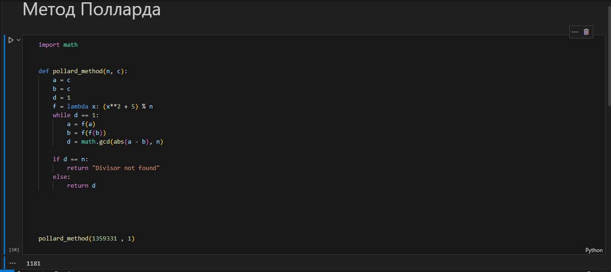
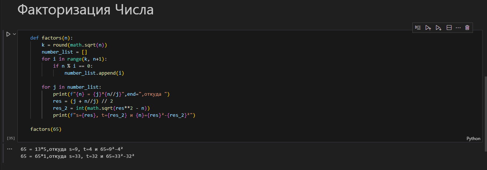

---
## Front matter
lang: ru-RU
title: Информационная безопасность. Лабораторная работа № 6 на тему "Разложение чисел на множители"
author: Мухамеджанов Исматулло Иззатуллоевич
group: NFImd-01-23
institute: RUDN University, Moscow, Russian Federation

## Formatting
toc: false
slide_level: 2
theme: metropolis
header-includes: 
 - \metroset{progressbar=frametitle,sectionpage=progressbar,numbering=fraction}
 - '\makeatletter'
 - '\beamer@ignorenonframefalse'
 - '\makeatother'
aspectratio: 43
section-titles: true
---

# Содержание
* Цели и задачи
* Выполнение
* Результаты
* Список литературы

# Цели и задачи
Освоить на практике применение шифров на основе замены

# Выполнение
<!-- ## Выполнение
{#fig:form1 width=100%}
{#fig:form1 width=100%} -->

## Выполнение

## Выполнение

# Результаты
Освоены методы разложения чисел на множители

# Список литературы
1. Методические материалы курса